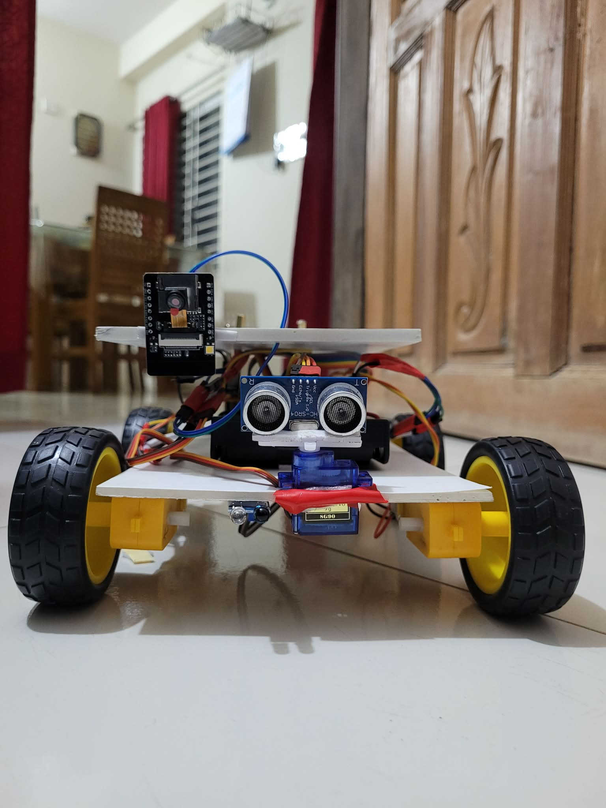
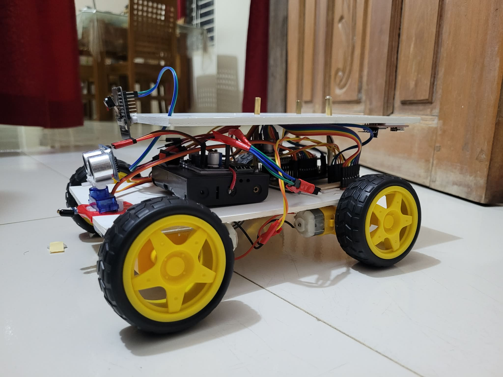
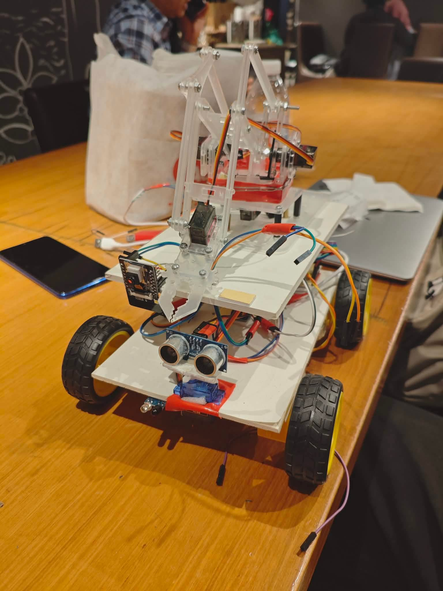

  

# ResQ Rover: Intelligent Rescue Robot

## Project Overview

**ResQ Rover** is an ESP32-based intelligent rescue robot designed to assist in emergency and disaster-response scenarios. The robot combines remote navigation, obstacle detection, real-time visual monitoring, fall detection, and a robotic arm for object handling.

The system aims to improve accessibility and situational awareness in environments that may be unsafe for human responders.

---

## Features

### 🚗 Remote Navigation
- WiFi-based control using a smartphone
- Real-time movement control

### 📡 Obstacle Detection
- HC-SR04 ultrasonic sensor for distance measurement
- IR sensors for nearby obstacle detection
- Automatic stopping when obstacles are detected
- Buzzer alert

### 📷 Real-Time Visual Monitoring
- ESP32-CAM live video streaming
- Remote monitoring through a web interface

### ⚠️ Fall Detection System
- MPU6050 accelerometer and gyroscope
- Robot tilt monitoring
- Buzzer alert for abnormal tilt or fall conditions

### 🤖 Robotic Arm
- 4-DOF robotic arm using MG90S servo motors
- Base rotation
- Shoulder movement
- Elbow movement
- Gripper actuation

---

## Hardware Components

| Component | Quantity |
|------------|----------|
| ESP32 DevKit V1 | 1 |
| ESP32-CAM | 1 |
| MPU6050 | 1 |
| HC-SR04 Ultrasonic Sensor | 1 |
| IR Sensors | 1 |
| MG90S Servo Motors | 4 |
| TT Gear Motors | 4 |
| TB6612FNG Motor Driver | 1 |
| Active Buzzer | 1 |
| 7.4V Battery Pack | 1 |
| ESP32 Expansion Board | 1 |
| FTDI Programmer | 1 |
| Chassis and Wheels | 1 Set |

---

## Software and Libraries

- Arduino IDE
- ESP32 Board Package
- ESP32Servo Library
- MPU6050_tockn Library
- ArduinoJson
- WebSockets
- WiFi Library
- Wire Library
- CameraWebServer Libraries

---

## System Workflow

1. The robot receives movement commands through a WiFi-based control interface.
2. Ultrasonic and IR sensors continuously monitor obstacles.
3. The ESP32-CAM streams live video to the operator.
4. The MPU6050 monitors robot orientation and detects abnormal tilting.
5. The robotic arm manipulates small objects during rescue operations.
6. A buzzer alert is triggered during emergency situations such as obstacle proximity or fall detection.

---

## Project Images

### Robot Overview

### Hardware Setup

### Robotic Arm

## Demo Video

🎥 Demo Video:

[Add Demo Video Link Here](#)

---

## Team Members

| Name | Role |
|--------|--------|
| Hasibur Rahman | Rover |
| Fahim Shahriar | Rover |
| Maisha Tabassum | Arm |
| Mohiuddin Nafees | Arm |

---

## Conclusion

ResQ Rover demonstrates the integration of robotics, wireless communication, sensing technologies, and real-time monitoring into a rescue-oriented platform.

The project successfully validates the feasibility of an intelligent rescue robot while highlighting opportunities for future enhancements and real-world deployment.

---

## License

This project is developed for educational and research purposes.
